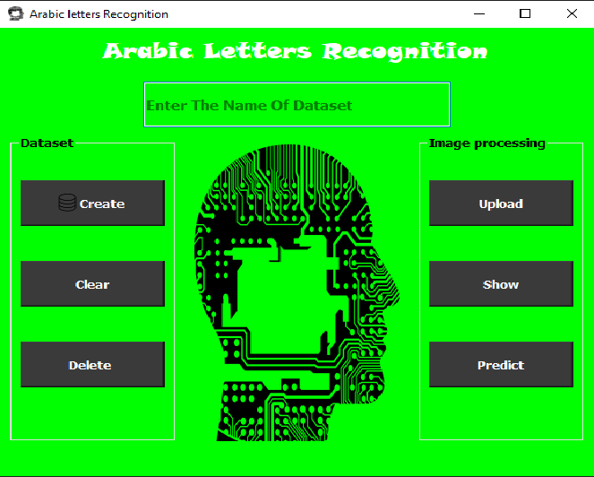

# Recogntion of offline Arabic Handwritten Characters using Neural Networks

This is a AI project made for having an introduction about the deep learing and what convolution neural network is. We train a model that recognize the arabic letters and gives us the prediction of that letter.

---
# Project

> Languages: Python-Pyqt5-Tensorflow
> Remark
* Enter the folder name (Test)
* click show for displaying the letters
* click predict button for prediction
* You can create new folder with create button and upload photos of arabic letters then predict the letters
* You need ot download the model first for prediction
    * Model path: [https://drive.google.com/file/d/1iLI9a1Y7UqU0R2OCp4WemrQij_JgZuZt/view?usp=sharing](https://drive.google.com/file/d/1iLI9a1Y7UqU0R2OCp4WemrQij_JgZuZt/view?usp=sharing)
