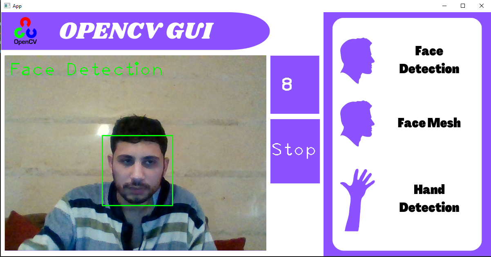

# Opencv GUI
This is a simple project about opencv functions with graphical user interface. It was made to show us the concept on how we could make a gui with opencv onlu without needing for any exteranl packages, it could only reached with image processing.

---

* Requirementes: 
    
    * Python 
    * Opencv

> This project made for educational purposes for beginners that why it is localhost